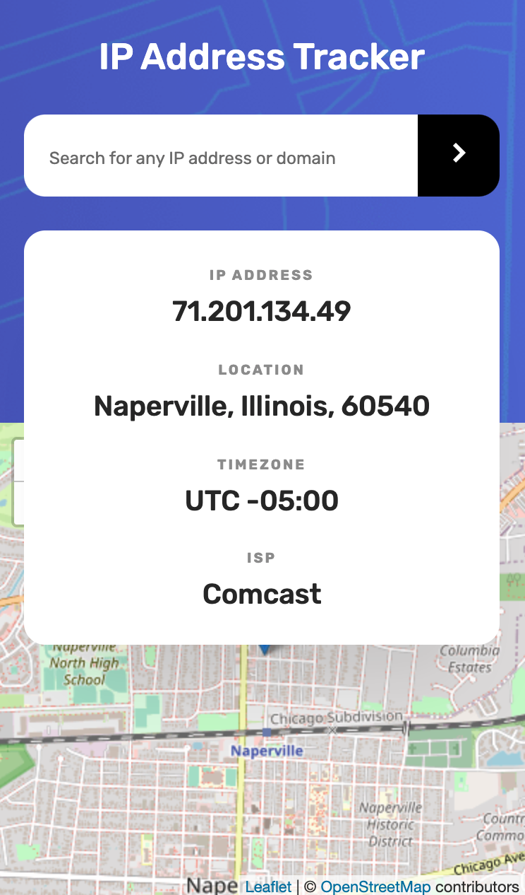
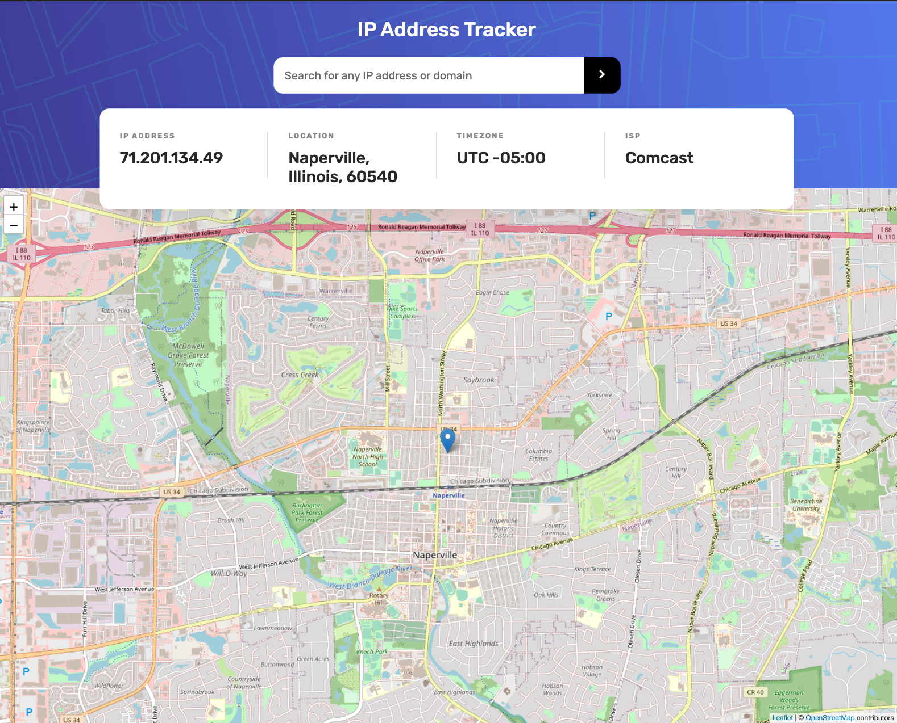

# Frontend Mentor - IP address tracker # Frontend Mentor - IP address tracker solution

## Welcome! 👋

This is a solution to the [IP address tracker challenge on Frontend Mentor](https://www.frontendmentor.io/challenges/ip-address-tracker-I8-0yYAH0). Frontend Mentor challenges help you improve your coding skills by building realistic projects.

## Table of contents

- [Overview](#overview)
  - [The challenge](#the-challenge)
  - [Screenshot](#screenshot)
  - [Links](#links)
- [My process](#my-process)
  - [Built with](#built-with)
  - [What I learned](#what-i-learned)
  - [Continued development](#continued-development)
  - [Useful resources](#useful-resources)
- [Author](#author)
- [Acknowledgments](#acknowledgments)

## Overview

## The challenge

The challenge was to build out this IP Address Tracker app and get it looking as close to the design as possible. To get the IP Address locations, I used [IP Geolocation API by IPify](https://geo.ipify.org/). To generate the map, I used [LeafletJS](https://leafletjs.com/).

Users are able to:

- View the optimal layout for each page depending on their device's screen size
- See hover states for all interactive elements on the page
- See their own IP address on the map on the initial page load
- Search for any IP addresses or domains and see the key information and location

---

### Screenshot

| Mobile (375px)                                 | Desktop (1440px)                                 |
| ---------------------------------------------- | ------------------------------------------------ |
|  |  |

### Links

- Solution URL: [Code](https://github.com/amallen1/ip-address-tracker)
- Live Site URL: [IP Address Tracker](https://your-live-site-url.com)

## My process

### Built with

- Semantic HTML5 markup
- CSS custom properties
- Flexbox
- Mobile-first workflow
- [React](https://reactjs.org/) - JS library
- [Styled Components](https://styled-components.com/) - For styles
- [IP Geolocation API](https://geo.ipify.org/)
- [LeafletJS](https://leafletjs.com/)
- [React Leaflet](https://react-leaflet.js.org/)

### What I learned

I'm glad to have gained the experience of using open source libraries such as LeafletJS and React Leaflet to incorporate maps into this React app. Using LeafletJS and React Leaflet was challenging but a worthwhile learning experience. I also learned about the difference between IPv4 and IPv6 address how to use regular expressions to validate ip them.

### Useful resources

- [StackOverflow](https://stackoverflow.com/questions/49441600/react-leaflet-marker-files-not-found) - Helped clear up some confusion I had when integrating LeafletJS/React Leaflet into my code when the documentation didn't have the answers I was looking for.

- [RegExr](https://regexr.com/) - This website helped me to test my regular expression I used for validating IP addresses.

## Author

- Frontend Mentor - [@amallen1](https://www.frontendmentor.io/profile/amallen1)
